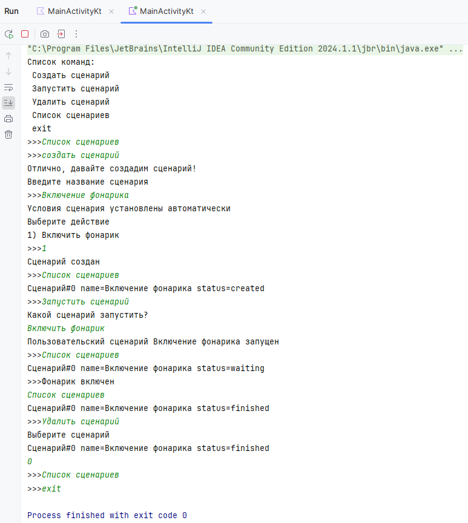

# Assistant
Консольное приложение на Kotlin для создания и выполнения пользовательских сценариев
- Содержит иерархию классов
  - Родительский класс Script для сценариев с условиями
  - Дочерний класс Command для хранения пользовательских команд и условий их выполнения
  - Дочерний класс Routine для хранения пользовательских сценариев
- Классы содержат метод вывода на экран и переопределённый метод длительной обработки
  - Родительский класс имеет заглушку
  - Дочерний класс Command выполняет в основном потоке без оповещения в консоль
  - Дочерний класс Routine выполняет в параллельном потоке с оповещением в консоль и отслеживанием статуса выполнения методом getStatus()
- Основной класс (не путать с родительским) содержит коллекции дочерних классов
  - Коллекция Command для основных пользовательских команд
  - Коллекция Routines для пользовательских сценариев с выводом, сортировкой, фильтрацией, удалением и созданием элементов

Примечание: некоторые методы и реализации могут казаться натянутыми так как консольное приложение разработано для дальнейшего развития, недостатки интерфейса и отсутствующие сообщения будут исправлены в мобильном приложении
- Распознавание команд без дословного ввода будет использовано в дальнейшем
- Исходный код снабжён исчерпывающим количеством документации, дублирование здесь считаю излишним

https://github.com/teodoroven/Assistant

